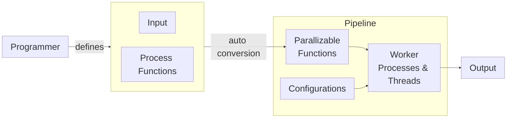

# Master Project

> Weilue Luo April 2022 @UCL

## Description

### Problem

Highly labor intensive task constitute up to 50% budget.

| Current Process                                              |                                                              |
| ------------------------------------------------------------ | ------------------------------------------------------------ |
| **1 Key poses / Layout**<br />Major actions & Placement<br /> | **2 Roughs / Inbetweening**<br />Timing & Frame distribution<br /> |
| **3 Cleanup / Inking**<br />Cleanup, Styles & Motion Effects<br /> | **4 Colour / Mattes**<br />Coloring, Shadows & Highlight<br /> |

Currently, lead artist gives front-loaded creative input followed by labor intensive tasks that he has little control. We want lead artist to get an accurate preview of what might be the final product. In particular, when they create the basis for character movement.

### Proposed System

1. Prepare training data, ingesting from the client database.
2. Processing stage to tag the data for use.
   - This requires: core model, processing block design, fine tune hyper-parameters to avoid local minima.


3. Optimization, compact-ification, scaling and sacrifice for real-time output.

#### Expected Work flow

```mermaid
flowchart LR

lead["<font size=6>Artist"]
keyframes["<font size=6>Keyframes"]
roughframes["<font size=6>Rough Frames"]
genframes["<font size=6>Generate Frames\n(RNN, AE, MV)"]
cleanup_matting["<font size=6>Clean Up & Matting\n(GAN, CNN, VQVAE)\nUpsampling"]
finaloutput["<font size=6>Output Frames"]
timingnotes["<font size=6>Timing Notes"] 
linestyle["<font size=6>Overall Line Style"]
tag["<font size=6>Optional Tags"]

lead -->|<font size=6>interactive edit| roughframes
lead -->|<font size=6>draw| keyframes --> genframes
lead  -->|<font size=6>select| tag & linestyle & timingnotes
roughframes --> cleanup_matting
timingnotes --> genframes
genframes <--> roughframes
tag & linestyle --> cleanup_matting --> finaloutput


subgraph  <font size=6>Layout
 keyframes
end

subgraph <font size=6>ML Techniques
	

     subgraph <font size=6>In-betweening
     genframes
     end

     subgraph <font size=6>CleanUp & Matting
     cleanup_matting
     end
     
end


```

### Goal

To build a prototype that calculates in-between frames and interactively change the style of the output.

## Papers

### General In-betweening

- https://developer.nvidia.com/blog/googles-ai-can-fill-in-the-missing-frames-in-a-video-sequence/
- [From Here to There: Video Inbetweening Using Direct 3D Convolutions](https://arxiv.org/pdf/1905.10240.pdf)
- [FLAVR: Flow-Agnostic Video Representations for Fast Frame Interpolation](https://arxiv.org/pdf/2012.08512.pdf)
- [A Deep Learning Framework for Character Motion Synthesis and Editing](https://www.ipab.inf.ed.ac.uk/cgvu/motionsynthesis.pdf)
- [Generative Tweening: Long-term Inbetweening of 3D Human Motions](https://arxiv.org/pdf/2005.08891.pdf)


- [Depth-Aware Video Frame Interpolation](https://github.com/baowenbo/DAIN) 
- [SoftSplat](https://github.com/sniklaus/softmax-splatting)
- [Asymmetric Bilateral Motion Estimation for Video Frame Interpolation](https://github.com/junheum/abme)
- [Real-Time Intermediate Flow Estimation for Video Frame Interpolation (RIFE)](https://github.com/hzwer/arXiv2021-RIFE) *SOTA for real-time?

### Animation In-betweening

- [A filter based approach for inbetweening](https://arxiv.org/abs/1706.03497)
  - https://www.animenewsnetwork.com/interest/2017-06-16/a.i-program-creates-practically-perfect-in-between-animation/.117588
- [Structure-aware generative learning](https://www.slideshare.net/hamadakoichi/anime-generation-ai)
- [Data Driven In-betweening for Hand Drawn Rotating Face](https://dl.acm.org/doi/pdf/10.1145/1836845.1836853)
- [Deep Animation Video Interpolation in the Wild](https://github.com/lisiyao21/AnimeInterp) *SOTA? but did not mention speed in paper so assumed slow


### Up-sampling / Clarification (Restoration)

- [Real-ESRGAN](https://github.com/xinntao/Real-ESRGAN)
- [Waifu2x](https://github.com/nagadomi/waifu2x)
- [SwinLR](https://github.com/JingyunLiang/SwinIR) *SOTA?
- [TraiNNer](https://github.com/victorca25/traiNNer)
- [Old Photo Restoration](https://github.com/microsoft/Bringing-Old-Photos-Back-to-Life) & [Bring Old Films Back to Life](https://github.com/raywzy/Bringing-Old-Films-Back-to-Life)

### Misc

- Animation oriented keyframe generation? How to make it a smooth animation?
  - https://www.reddit.com/r/anime/comments/7u51e7/can_somebody_explain_me_how_key_and_inbetween/
  - low quality VS deliberate animation
- **baseline**?: generate features in the keyframes and interpolate using image processing
- https://www.reddit.com/r/anime/comments/7u51e7/can_somebody_explain_me_how_key_and_inbetween/
  - [Smears, Multiples and Other Animation Gimmicks](https://animationsmears.tumblr.com/)
- [opentoonz software for 2D animation creation](https://github.com/opentoonz/opentoonz)


#### Software

- [OpenToonz - An open-source full-featured 2D animation creation software](https://github.com/opentoonz/opentoonz)
- [CACANi](https://cacani.sg/?v=79cba1185463)

## Meetings

### 25 Apr

pix2pix, unet, rife

### 3 May

- 1-way NDA before tomorrow
- 

## Miscellaneous

- **Annesah** organizing relations to external partners of UCL, such as the company No Ghost.

### preprocessing



